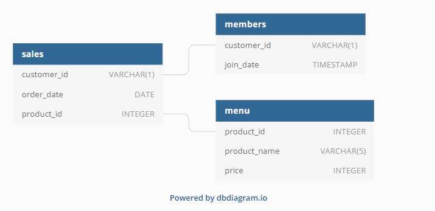

# Entity Relationship Diagram

# Question
# Q1. What is the total amount each customer spent at the restaurant?

SELECT 
    s.customer_id, 
    sum(m.price) as total_sale
FROM sales s 
    INNER JOIN menu m ON s.product_id = m.product_id
GROUP BY s.customer_id
ORDER BY s.customer_id ASC;

# Q2. How many days has each customer visited the restaurant?

SELECT 
    s.customer_id, 
    COUNT(DISTINCT s.order_date) AS visit_count
FROM sales s
GROUP BY s.customer_id;

# Q3. What was the first item from the menu purchased by each customer?

WITH ordered_sales AS (
  SELECT 
    s.customer_id, 
    s.order_date, 
    m.product_name,
    DENSE_RANK() OVER (
      PARTITION BY s.customer_id 
      ORDER BY s.order_date) AS rank
  FROM sales s
    INNER JOIN menu m 
        ON s.product_id = m.product_id
)

SELECT 
  customer_id, 
  product_name
FROM ordered_sales
WHERE rank = 1
GROUP BY customer_id, product_name;

# Q4. What is the most purchased item on the menu and how many times was it purchased by all customers?

SELECT
    m.product_id, 
    m.product_name, 
    COUNT(s.product_id) AS number_of_purchases
FROM menu m 
    INNER JOIN sales s 
        ON m.product_id = s.product_id
GROUP BY m.product_id
ORDER BY number_of_purchases DESC
LIMIT 1;

# Q5. Which item was the most popular for each customer?

WITH ordered_sales AS (
  SELECT 
    s.customer_id, 
    s.order_date, 
    m.product_name,
    DENSE_RANK() OVER (
      PARTITION BY s.customer_id 
      ORDER BY s.order_date) AS rank
  FROM sales s
  INNER JOIN menu m
    ON s.product_id = m.product_id
)

SELECT 
  customer_id, 
  product_name
FROM ordered_sales
WHERE rank = 1
GROUP BY customer_id, product_name;

# Q6. Which item was purchased first by the customer after they became a member?

WITH joined_as_member AS (
  SELECT
    m.customer_id, 
    s.product_id,
    ROW_NUMBER() OVER (
      PARTITION BY m.customer_id
      ORDER BY s.order_date) AS row_num
  FROM members m
  INNER JOIN sales s
    ON m.customer_id = s.customer_id
    AND s.order_date >= m.join_date
)

SELECT 
  customer_id, 
  product_name 
FROM joined_as_member j
    INNER JOIN menu m
        ON j.product_id = m.product_id
WHERE row_num = 1
ORDER BY customer_id ASC;

# Q7. Which item was purchased just before the customer became a member?

WITH purchased_prior_member AS (
  SELECT 
    m.customer_id, 
    s.product_id,
    ROW_NUMBER() OVER (
      PARTITION BY m.customer_id
      ORDER BY s.order_date DESC) AS rank
  FROM members m
    INNER JOIN sales s
        ON m.customer_id = s.customer_id
        AND s.order_date < m.join_date
)

SELECT 
  p.customer_id, 
  m.product_name 
FROM purchased_prior_member p
    INNER JOIN menu m
        ON p.product_id = m.product_id
WHERE rank = 1
ORDER BY p.customer_id ASC;

# Q8. What is the total items and amount spent for each member before they became a member?

SELECT 
  s.customer_id, 
  COUNT(s.product_id) AS total_items, 
  SUM(mn.price) AS total_sales
FROM sales s
    INNER JOIN members m
        ON s.customer_id = m.customer_id
        AND s.order_date < m.join_date
    INNER JOIN menu mn
        ON s.product_id = mn.product_id
GROUP BY s.customer_id
ORDER BY s.customer_id;

# Q9. If each $1 spent equates to 10 points and sushi has a 2x points multiplier — how many points would each customer have?

WITH points_cte AS (
  SELECT 
    product_id, 
    CASE
      WHEN product_id = 1 THEN price * 20
      ELSE price * 10 END AS points
  FROM menu
)

SELECT 
  sales.customer_id, 
  SUM(p_cte.points) AS total_points
FROM sales s
    INNER JOIN points_cte p_cte
        ON s.product_id = p_cte.product_id
GROUP BY s.customer_id
ORDER BY s.customer_id;

# Q10: In the first week after a customer joins the program (including their join date) they earn 2x points on all items, not just sushi — how many points do customer A and B have at the end of January?

WITH dates_cte AS (
  SELECT 
    customer_id, 
      join_date, 
      join_date + 6 AS valid_date, 
      DATE_TRUNC(
        'month', '2021-01-31'::DATE)
        + interval '1 month' 
        - interval '1 day' AS last_date
  FROM members
)

SELECT 
  sales.customer_id, 
  SUM(CASE
    WHEN mn.product_name = 'sushi' 
        THEN 2 * 10 * mn.price
    WHEN s.order_date BETWEEN d.join_date AND d.valid_date 
        THEN 2 * 10 * mn.price
    ELSE 10 * mn.price END) AS points
FROM sales s
    INNER JOIN dates_cte d
        ON s.customer_id = d.customer_id
        AND d.join_date <= s.order_date
        AND s.order_date <= d.last_date
    INNER JOIN menu mn
        ON s.product_id = mn.product_id
GROUP BY sales.customer_id;

